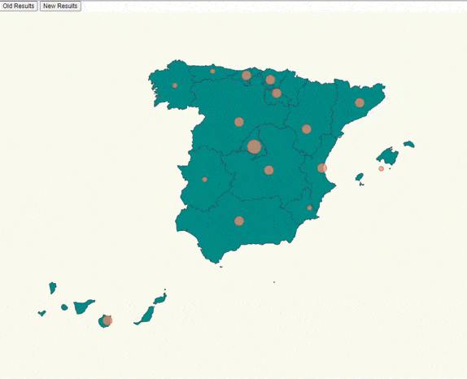

# 01-Interactive-Covid-Map

- We are going to do something like this:




We have to face three challenges here:

- Place pins on a map based on location.
- Scale pin radius based on affected number.
- Add buttoms to update the radius based on affected number
- Spain got canary island that is a territory placed far away, we need to cropt that islands and paste them in a visible
  place in the map.

# Steps

We will take as starting this example: https://github.com/Lemoncode/d3js-typescript-examples/tree/master/02-maps/02-pin-location-scale , let's copy the content and execute npm start
```bash
npm install
```
And then execute:
```bash
npm start
```

- Firstly, we are going to add the new values of those affected by each autonomous community by adding the following:

_./stats.ts

```diff
+ export const newStats: ResultEntry[] = [
+  {
+    name: "Madrid",
+    value: 14842,
+  },
+  {
+    name: "La Rioja",
+    value: 259 ,
+  },
+  {
+    name: "Andalucía",
+    value: 10179,
+  },
+  {
+    name: "Cataluña",
+    value: 12797,
+  },
+  {
+    name: "Valencia",
+    value: 1466 ,
+  },
+  {
+    name: "Murcia",
+    value: 823,
+  },
+  {
+    name: "Extremadura",
+    value: 930,
+  },
+  {
+    name: "Castilla La Mancha",
+    value: 1596,
+  },
+  {
+    name: "País Vasco",
+    value: 4241,
+  },
+  {
+   name: "Cantabria",
+    value: 588,
+  },
+  {
+    name: "Asturias",
+    value: 1615,
+  },
+  {
+    name: "Galicia",
+    value: 1978,
+  },
+  {
+    name: "Aragón",
+    value: 1744,
+  },
+  {
+    name: "Castilla y León",
+    value: 2613,
+  },
+  {
+   name: "Islas Canarias",
+   value: 2955,
+ },
+ {
+   name: "Islas Baleares",
+   value: 546,
+ },
+ ];
```

- Note that we have to add the following code in the old values list:
```diff
- export const stats = {
+ export const stats: ResultEntry[] = [
 ``` 

- And let´s add the interface at the beginning of the _.src/stats.ts

```diff
+ export interface ResultEntry {
+  name: string;
+  value: number;
+ }
```

- Now, we have to import it

_./src/index.ts_

```diff
import * as d3 from "d3";
import * as topojson from "topojson-client";
const spainjson = require("./spain.json");
const d3Composite = require("d3-composite-projections");
import { latLongCommunities } from "./communities";
import { 
  stats,
+  newStats,
+  ResultEntry
   } from "./stats";
```

- On _index.html we are going to add two buttons that will be with what we update the values of positive cases of covid-19

_./src/index.html

```diff
<html>
  <head>
    <link rel="stylesheet" type="text/css" href="./map.css" />
    <link rel="stylesheet" type="text/css" href="./base.css" />
  </head>
  <body>
+    <div>
+            <button id="OLD">Old Results</button>
+            <button id="NEW">New Results</button>
+          </div>
    <script src="./index.ts"></script>
  </body>
</html>
```

- Let's calculate the maximum number of affected of all communities:

_./src/index.ts_

```typescript
const maxAffected = stats.reduce(
  (max, item) => (item.value > max ? item.value : max),
  0
);
```

- Let's create an scale to map affected to radius size. The domain and range depend on the data that we are going to use.

_./src/index.ts_

```dif
const affectedRadiusScale =  d3
+  .scaleThreshold<number,number>()
+  .domain([0,10,100,1000,5000,10000,15000])
+  .range([0,5,10,15,20,35,40]);
```

- Let's create a helper function to glue the community name with the affected cases according to the data we want to show.

_./src/index.ts_

```dif

+ const calculateRadiusBasedOnAffectedCases = (data :ResultEntry[],comunidad: string) => {
+ const entry =  data.find((item) => item.name === comunidad);
  
 return entry ? affectedRadiusScale(entry.value) : 0;
};
```

- Let's tie it up with the circle rendering code that we created before:

_./src/index.ts_

```diff
svg
   svg
  .selectAll("circle")
  .data(latLongCommunities)
  .enter()
  .append("circle")
  .attr("class", "affected-marker")
+  .attr("r", (d) => calculateRadiusBasedOnAffectedCases(stats,d.name))
  .attr("cx", (d) => aProjection([d.long, d.lat])[0])
  .attr("cy", (d) => aProjection([d.long, d.lat])[1]);
```

- Let's add a method to swap the data we are using, we will append all this code at the end of the index.ts file:

_./src/index.ts

```diff
+ const updateMap = (data: ResultEntry[]) => {
+  d3
+   .selectAll("circle")
+   .data(latLongCommunities)
+   .attr("class", "affected-marker")
+   .transition()
+   .duration(1500)
+   .attr("r", (d) => calculateRadiusBasedOnAffectedCases(data,d.name))
+   .attr("cx", (d) => aProjection([d.long, d.lat])[0])
+   .attr("cy", (d) => aProjection([d.long, d.lat])[1]);
+ };
```
- And now call them on each button with the corresponding data:

```diff
+ document
+  .getElementById("OLD")
+  .addEventListener("click", function handleOldResults() {
+   updateMap(stats);
+  });

+ document
+  .getElementById("NEW")
+  .addEventListener("click", function handleNewResults() {
+   updateMap(newStats);
+  });
```

## Author: Álvaro Martín Jiménez
